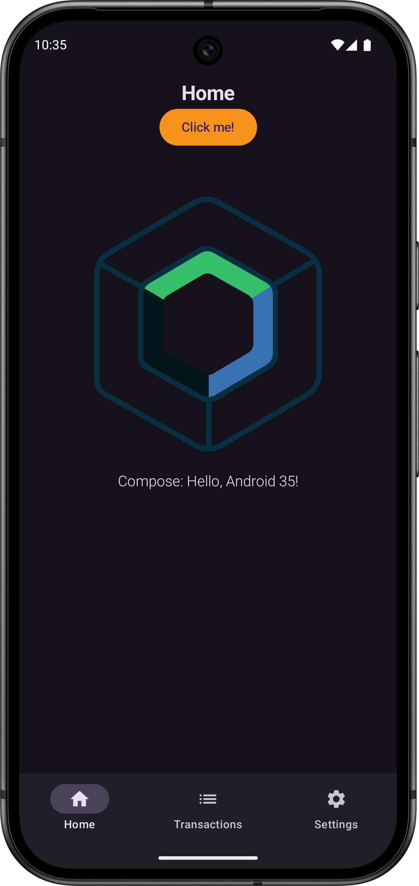

# Hodl

 <!-- x-release-please-version -->

Crypto portfolio tracking app for Android, iOS and Desktop.



## Project Structure

This KMP project utilizes a modular architecture, combining traditional KMP module organization with
Clean Architecture principles and a package-by-feature structure for improved maintainability and scalability.

```
Hodl/
├── shared/                              // Code that's shared across KMP applications
│   └── src/
│       ├── commonMain/                  // Code that’s common for all targets
│       │   └── kotlin/com/digrec/hodl/
│       │       ├── HodlApp.kt           // Entry point for shared UI
│       │       ├── core/                // Core business logic, use cases, interfaces
│       │       │   ├── domain/
│       │       │   └── data/
│       │       ├── feature/             // Feature modules
│       │       │   ├── authentication/
│       │       │   │   ├── data/
│       │       │   │   ├── domain/
│       │       │   │   └── ui/          // UI Components, screens and ViewModels
│       │       │   ├── settings/
│       │       │   │    └── ...         // Same structure as authentication
│       │       │   └── ...
│       │       ├── di/                  // Dependency injection
│       │       ├── ui/                  // Shared UI components and theme
│       │       │   ├── component/
│       │       │   ├── theme/
│       │       │   └── util/
│       │       └── util/                // Shared utility functions
│       ├── androidMain/                 // Kotlin code compiled for Android platform
│       │   └── kotlin/com/digrec/hodl/
│       ├── iosMain/                     // Kotlin code compiled for iOS platform
│       │   └── kotlin/com/digrec/hodl/
│       └── desktopMain/                 // Kotlin code compiled for desktop platforms
│           └── kotlin/com/digrec/hodl/
├── androidApp/                          // Android app that depends on shared module
│   └── src/androidMain/
├── iosApp/                              // iOS app that depends on shared module
│   └── iosApp/
└── desktopApp/                          // Desktop app that depends on shared module
    └── src/desktopMain/
```

Learn more about [Kotlin Multiplatform](https://www.jetbrains.com/help/kotlin-multiplatform-dev/get-started.html)…

### Versioning

This project uses [Release Please](https://github.com/googleapis/release-please) for automated 
version management and changelog generation. 

Release Please:

- Automatically determines the next semantic version based on conventional commits
- Creates release PRs with version bumps and updated changelog
- Updates version badges and references throughout the codebase

To make a release:
1. Ensure all commits follow [Conventional Commits](https://www.conventionalcommits.org/) format 
(e.g., `feat:`, `fix:`, `docs:`, etc.)
2. The Release Please GitHub Action will automatically create a release PR when new conventional 
commits are pushed to the main branch
3. Once the release PR is merged, a new version will be published and tags will be created

## How to run

Open the project in Android Studio or IntelliJ and run `androidApp`, `iosApp` or `desktopApp` run configuration.

### Desktop

Run native distribution of the desktop app using this command:

```shell
./gradlew runDistributable
```

- Desktop app version is then shown correctly because `jpackage.app-version` is set from
  the `packageVersion` defined in desktop `build.gradle.kts` file.

#### Compose Hot Reload

Compose Hot Reload is supported only for the desktop target and requires JetBrains JDK 21 toolchain.

**Gradle**

```shell
./gradlew :desktopApp:hotRunDesktop -DmainClass=com.digrec.hodl.MainKt --auto
```

**IntelliJ IDE**

Click `Run 'desktopApp [hotRunDesktop]' with Compose Hot Reload` button in the file gutter of the
`com.digrec.hodl.Main.kt` file. 
