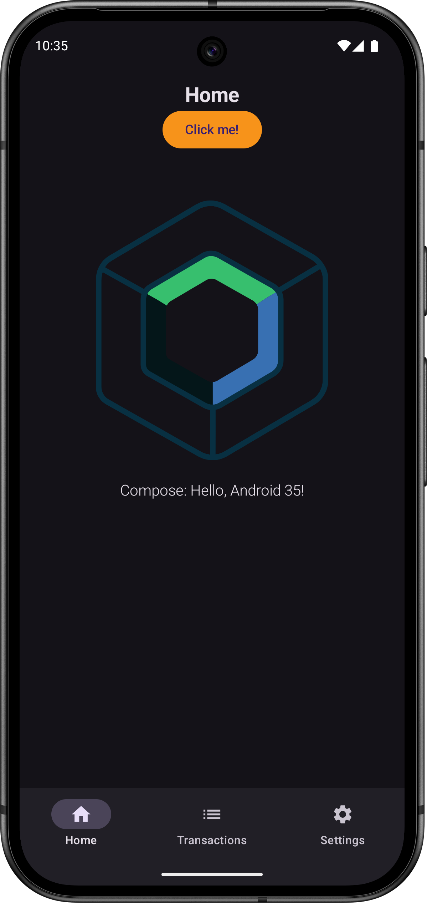

# Hodl

 <!-- x-release-please-version -->

Crypto portfolio tracking app for Android, iOS and Desktop.



## Project Structure

This KMP project utilizes a modular architecture, combining traditional KMP module organization with
Clean Architecture principles and a package-by-feature structure for improved maintainability and
scalability.

```
Hodl/
├── shared/                              // Code that's shared across KMP applications
│   └── src/
│       ├── commonMain/                  // Code that’s common for all targets
│       │   └── kotlin/com/digrec/hodl/
│       │       ├── HodlApp.kt           // Entry point for shared UI
│       │       ├── core/                // Core business logic, use cases, interfaces
│       │       │   ├── domain/
│       │       │   └── data/
│       │       ├── di/                  // Dependency injection
│       │       ├── feature/             // Feature modules
│       │       │   ├── currency/
│       │       │   │   ├── data/
│       │       │   │   ├── domain/
│       │       │   │   └── ui/          // UI Components, screens and ViewModels
│       │       │   ├── home/
│       │       │   ├── settings/
│       │       │   └── transactions/
│       │       ├── navigation/          // Navigation logic and graphs
│       │       └── ui/                  // Shared UI components and theme
│       │           ├── composition/     // Local composition providers
│       │           └── theme/           // App theme, colors, typography
│       ├── commonTest/                  // Common unit testing suite for all targets
│       │   └── kotlin/com/digrec/hodl/
│       ├── androidMain/                 // Kotlin code compiled for Android platform
│       │   └── kotlin/com/digrec/hodl/
│       ├── iosMain/                     // Kotlin code compiled for iOS platform
│       │   └── kotlin/com/digrec/hodl/
│       └── desktopMain/                 // Kotlin code compiled for desktop platforms
│           └── kotlin/com/digrec/hodl/
├── androidApp/                          // Android app that depends on shared module
│   └── src/main/
├── iosApp/                              // iOS app that depends on shared module
│   └── iosApp/
└── desktopApp/                          // Desktop app that depends on shared module
    └── src/main/
```

Learn more
about [Kotlin Multiplatform](https://www.jetbrains.com/help/kotlin-multiplatform-dev/get-started.html)…

## Tech Stack & Tooling

| Component | Technology | Reference |
| :--- | :--- | :--- |
| **Language & SDK** | Kotlin (JDK 17 toolchain), Android SDK 37 | [`gradle/libs.versions.toml`](gradle/libs.versions.toml) |
| **Build System** | Gradle, Android Gradle Plugin (AGP) | [`gradle/libs.versions.toml`](gradle/libs.versions.toml) |
| **UI Framework** | Compose Multiplatform | [`gradle/libs.versions.toml`](gradle/libs.versions.toml) |
| **Dependency Injection** | Koin | [`gradle/libs.versions.toml`](gradle/libs.versions.toml) |
| **Database** | Room KMP (`sqlite-bundled`) | [`gradle/libs.versions.toml`](gradle/libs.versions.toml) |
| **Unit Testing** | Kotlin Test, Coroutines Test, Koin Test, Turbine | [`gradle/libs.versions.toml`](gradle/libs.versions.toml) |
| **Logging** | Kermit | [`gradle/libs.versions.toml`](gradle/libs.versions.toml) |
| **Code Formatter** | ktfmt (`kotlinLangStyle`) | [`gradle/libs.versions.toml`](gradle/libs.versions.toml) |

> [!NOTE]
> All specific library versions are defined centrally in [`gradle/libs.versions.toml`](gradle/libs.versions.toml).

### AI Coding Agents & Guidelines

AI Agents working on this codebase should refer to [`AGENTS.md`](AGENTS.md) for architectural conventions, Compose `@Preview` rules, Conventional Commits format, and build verification instructions.

### Versioning

This project uses [Release Please](https://github.com/googleapis/release-please) for automated
version management and changelog generation.

Release Please:

* Automatically determines the next semantic version based on conventional commits
* Creates release PRs with version bumps and updated changelog
* Updates version badges and references throughout the codebase

To make a release:

1. Ensure all commits follow [Conventional Commits](https://www.conventionalcommits.org/) format with a headline and detailed body (e.g., `feat:`, `fix:`, `docs:`, etc.)
2. The Release Please GitHub Action will automatically create a release PR when new conventional
   commits are pushed to the main branch
3. Once the release PR is merged, a new version will be published and tags will be created

## How to run

Open the project in Android Studio or IntelliJ and run `androidApp`, `iosApp` or `desktopApp` run
configuration.

### Running Unit Tests

Execute the Kotlin Multiplatform unit testing suite for all shared code (Desktop JVM, Android Host, and iOS Simulator):

```shell
./gradlew :shared:allTests
```

Or run tests across all modules:

```shell
./gradlew test
```

### Desktop

Run native distribution of the desktop app using this command:

```shell
./gradlew :desktopApp:runDistributable
```

* Desktop app version is then shown correctly because `jpackage.app-version` is set from
  the `packageVersion` defined in desktop `build.gradle.kts` file.

#### Compose Hot Reload

Compose Hot Reload is supported only for the desktop target and requires JetBrains JDK 21 toolchain.

**Gradle**

```shell
./gradlew :desktopApp:hotRun --auto
```

**IntelliJ IDE**

Click `Run 'desktopApp [hot]' with Compose Hot Reload` button in the file gutter of the
`com.digrec.hodl.Main.kt` file.
